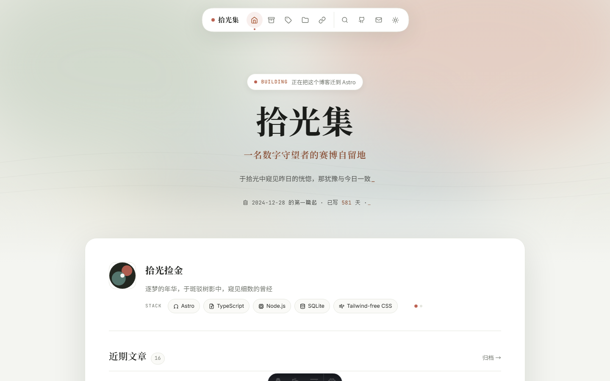
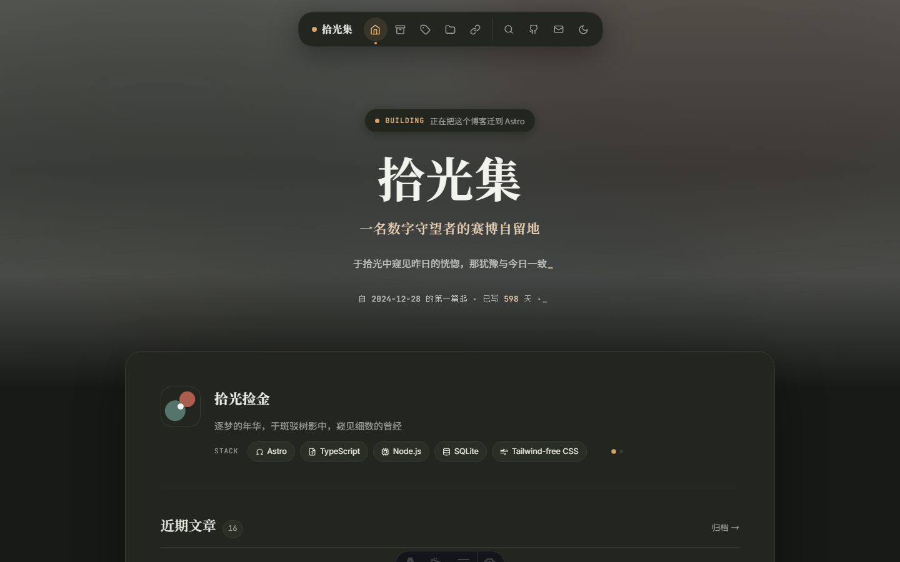
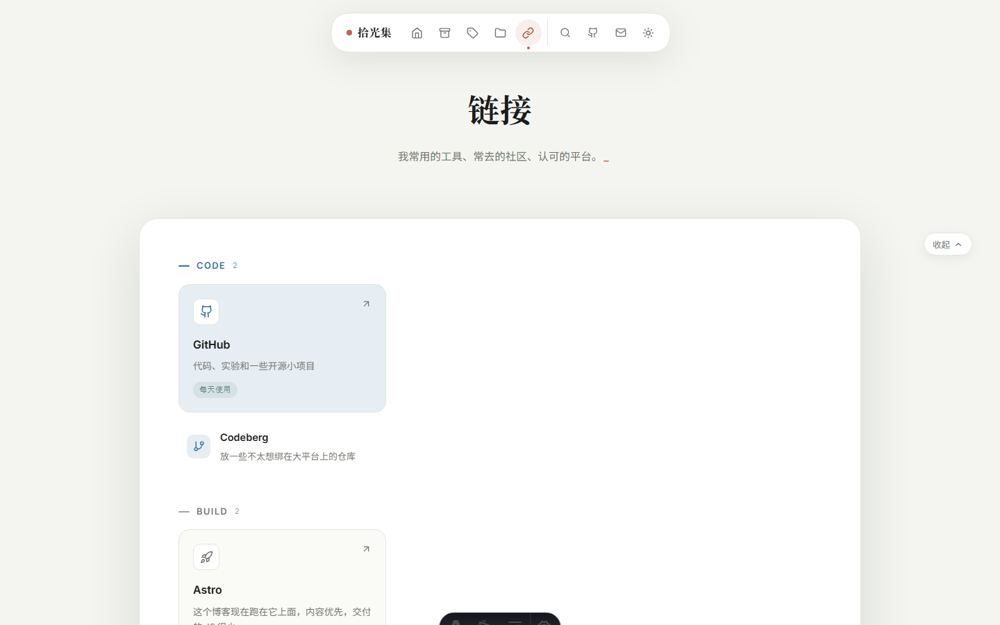
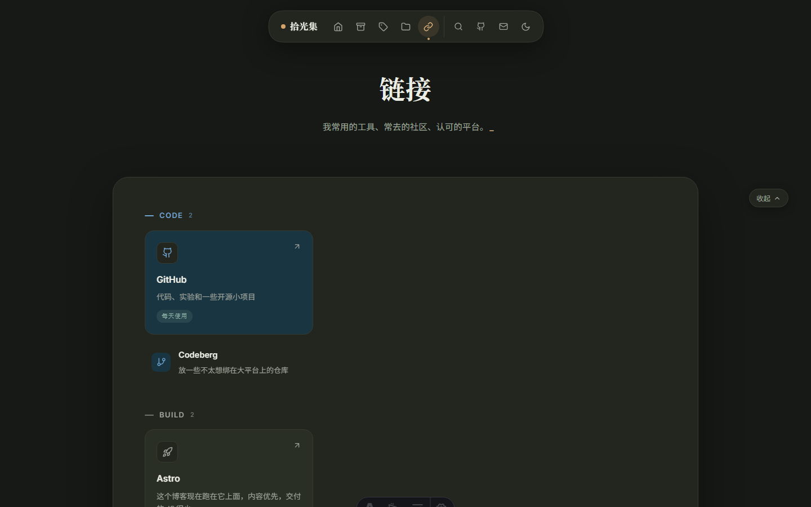
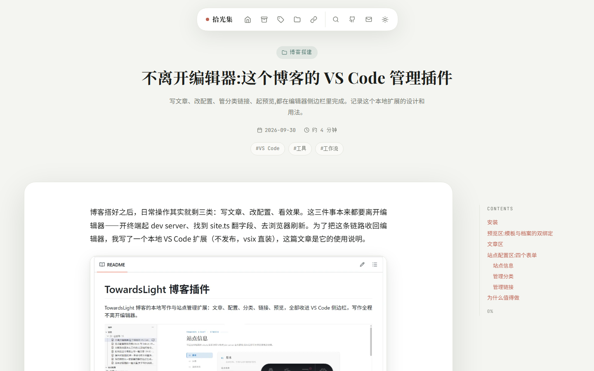

<p align="center">
  
  
</p>

# 拾光集 · TowardsLight

一个基于 Astro 5 的个人技术博客：居中 Hero、悬浮胶囊导航、悬浮主卡片、明亮/深色两套固定主题，文章按归档/标签/分类自动聚合，外加一个面向技术人员的链接目录。

<p align="center">
  
  
</p>
<p align="center">
  
</p>

## 特性

- Markdown 写作，Content Collections + Zod 校验，`draft: true` 不发布
- 归档、标签、分类全部由文章自动聚合，不用手工维护列表
- 明亮/深色两套固定主题，语义化 CSS 变量，首帧无闪烁，软导航下主题不丢失
- 三色语义池：褐红（accent)、青绿（contrast)、钢蓝（steel)。分类文件夹三色选一，Links 分组可整组着色，彩色分组建议不超过 3 个
- 文章页：桌面粘性目录 + 移动端目录抽屉、阅读进度条、上一篇/下一篇、正文图片点击放大
- 代码块 Shiki 双主题高亮，KaTeX 公式构建期渲染，两者都不需要客户端 JS
- 图片有兜底：封面可配焦点位置；正文图片引用失效时换成占位图并告警，不会拖垮整站
- 动效克制：CSS 过渡 + View Transitions，尊重 `prefers-reduced-motion`
- RSS:`/rss.xml` 自动生成

## 快速开始

```bash
npm install        # 安装依赖
npm run dev        # 开发服务器 http://localhost:4321
npm run build      # astro check + 生产构建 → dist/
npm run preview    # 本地预览构建产物
npm test           # 图片哨兵的单元测试
```

要求 Node.js ≥ 18.17（推荐 22+)。

## 配套扩展

[TowardsLight 扩展](https://github.com/iceforYuri/TowardsLight_extension)(VS Code，本地安装）：侧边栏管理文章、分类、链接和站点配置，一键启动预览，写作不用离开编辑器。

## 档案机制

文章、站点配置、链接、图片这些"属于身份"的内容都收在一个**档案目录**里，代码通过 `src/profiles/active` 这个统一指向读取。按优先级解析：

1. `SITE_PROFILE_DIR` 环境变量（或 `.env` 里一行），显式指定
2. `personal/`（项目根目录，已 gitignore)，存在即命中；在里面 `git init` 就是独立的内容仓库，模板库永不跟踪
3. `src/profiles/showcase/`，内置示例，前两者都没有时的默认值

切换是整体替换：档案配错或缺字段会在构建期直接报错，示例内容不会漏进你的站。每次 dev/build 前日志会打印当前档案。

```bash
node scripts/new-profile.mjs                 # 生成档案骨架(默认 ./personal)
SITE_PROFILE_DIR=src/profiles/showcase npm run build   # 显式指定档案
```

档案目录结构（`site.ts`、`links.ts`、`posts/` 必填，`images/` 可选）:

```text
my-blog-data/
├── site.ts      # 站名、作者、简介、Hero、默认主题、状态、分类图标、页面文案与各页背景
├── links.ts     # 链接目录:分组、整组色调、图标、卡片形态、首页展示、状态
├── posts/       # Markdown 文章
│   └── image/   # 文章级图片,按文章名归档,相对路径引用
└── images/      # 站点级图片:头像、Hero/页面背景、共用封面,以 /images/... 引用
```

两个使用注意：

- junction 切换对运行中的 dev server 不生效。切换指向后重启 dev server，否则内容和图片会错位。
- 同一目录同时只能跑一个档案（Astro 的内容缓存路径写死在项目根）。想并排对照两个档案，用 `git worktree` 开第二个工作副本，各自独立。

## 写一篇文章

在档案的 `posts/` 下新建 `.md`:

```yaml
---
title: 文章标题
description: 摘要,会出现在列表和 meta 里
pubDate: 2026-09-05
updatedDate: 2026-09-06      # 可选
category: 前端               # 任意字符串,自动聚合成分类页
tags: [Astro, 博客]          # 自动聚合成标签页
draft: false                 # true 则不构建
cover: /images/covers/wide.svg  # 可选;相对路径(如 image/my-post/cover.jpg)跟着文章走
coverAlt: 封面描述              # 可选
coverPosition: center 30%       # 可选,object-position 焦点
featured: false                 # 可选
---
```

更详细的说明见站内文章《如何在这个博客上写一篇文章》。

## 配置站点

| 配置项 | 位置 |
| --- | --- |
| 站名、作者、简介、导航、Hero 文案与背景、页面文案与各页背景、当前状态、翻牌栏、分类图标 | 档案的 `site.ts` |
| 链接目录（分组、整组色调、图标、卡片形态、首页展示、状态） | 档案的 `links.ts`(`featured`=大卡片，`home`=首页展示，最多 3 个） |
| 主题变量（画布/表面/文字/边框/强调色/阴影） | `src/styles/global.css` 顶部 |
| 站点 URL（影响 RSS / canonical) | `astro.config.mjs` 的 `site`，或部署时 `SITE_URL` 环境变量 |

## 主题机制

只有 Bright 与 Dark 两套固定主题，由 `<html data-theme>` 驱动。首帧前的内联脚本读 `localStorage.theme`，没有就跟随系统；切换只写 `data-theme` 并持久化；软导航时 `astro:before-swap` 把主题复制到新文档。

## 部署

任意静态托管（Vercel / Netlify / Cloudflare Pages / 自有服务器）:

```bash
npm run build      # 产物在 dist/
```

域名或子路径有变化时用 `SITE_URL` / `SITE_BASE` 环境变量覆盖，内部链接全部是 base 感知的。

## 图标与字体

图标是内联 Lucide SVG(`src/components/Icon.astro`，只打包用到的）。字体走 Google Fonts(Playfair Display / Noto Serif SC / Noto Sans SC / Inter / JetBrains Mono),`display=swap` 加系统字体回退。

## License

MIT
