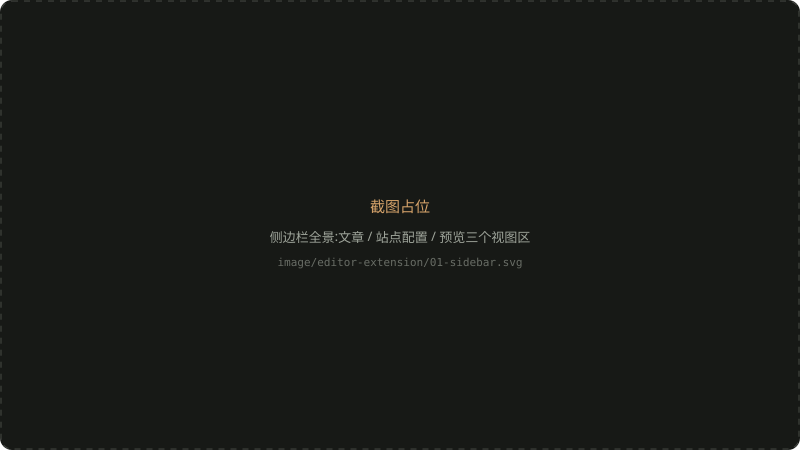
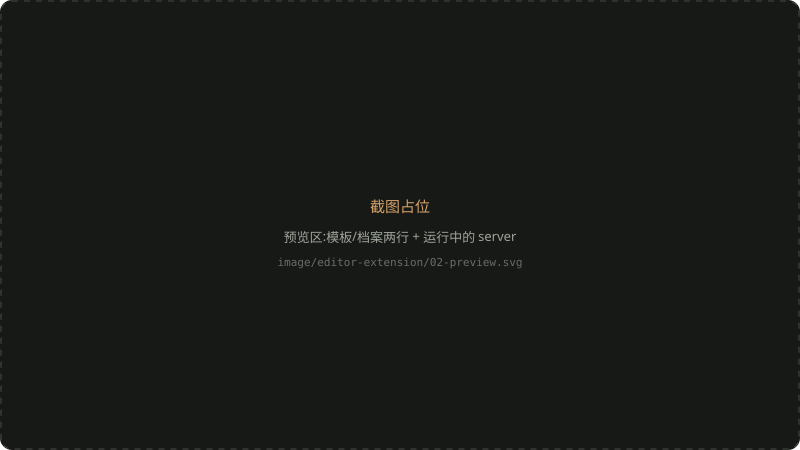
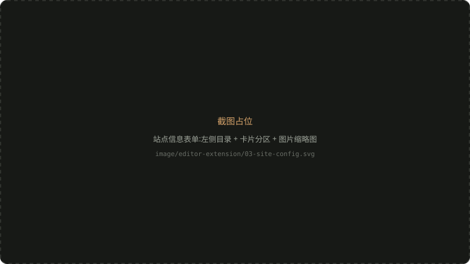
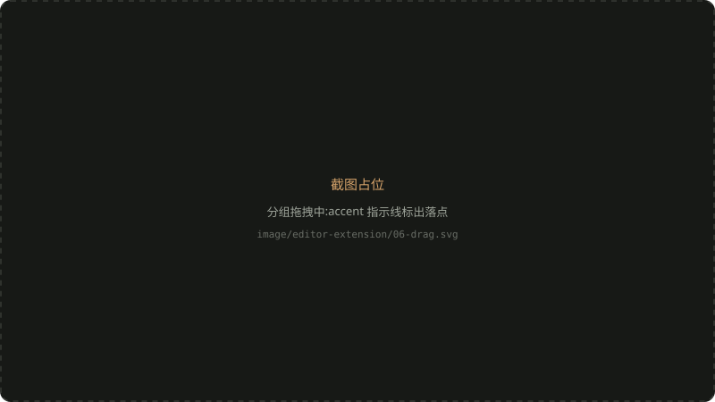

博客搭好之后，日常操作其实就剩三类：写文章、改配置、看效果。这三件事本来都要离开编辑器——开终端起 dev server、找到 site.ts 翻字段、去浏览器刷新。为了把这条链路收回编辑器，我写了一个本地 VS Code 扩展（不发布，vsix 直装），这篇文章是它的使用说明。



## 安装

扩展不在市场上，直接装构建出的 vsix:

```bash
code --install-extension towards-light-editor-0.6.1.vsix
```

装完 **Reload Window** 生效。活动栏多一个「博客」图标，点开是三个视图区：**文章、站点配置、预览**。

## 预览区:模板与档案的双绑定

预览区是三行：**模板目录、档案目录、启动预览**。

模板和内容在这个博客里本来就是两回事——模板是 Astro 工程，档案是 site.ts + links.ts + posts/ 的内容包。两个位置都是**自动识别、可手动覆盖**：模板认 `package.json` + 档案切换钩子，档案认 `site.ts` + `links.ts` + `posts/` 三件套，工作区往下两层内自动扫描。



点「启动预览」，扩展在模板目录里起 `npm run dev`，把档案目录通过环境变量传进去。起好的 server 会列在预览区，带端口和档案名，点击在浏览器打开，行内按钮停止。几个值得知道的细节:

- **server 是记账制的**：同一个「模板 + 档案」组合复用已有进程，端口被占自动顺延 4322、4323;
- **Reload Window 不会攒僵尸进程**——扩展激活时按上次记下的 PID 把孤儿 server 收掉（这个之前引发过 EMFILE);
- 你在自己终端里手动起的 dev server 它不动。

## 文章区

文章树按**草稿 / 已发布**分组，图标区分草稿、正文和 frontmatter 异常的文章。三个日常动作：

- **新建文章**：表单生成 slug（标题自动派生，可改）、分类带 datalist 补全、封面可以从电脑选图——图片会复制到 `posts/image/<slug>/` 并按相对路径引用；
- **预览文章**：行内按钮或命令面板，右侧开 iframe 面板渲染 dev server 的真实页面，没起 server 就顺带起一个;
- **插入正文图片**：Markdown 编辑器右键菜单，多选图片复制归档后在光标处插入引用。VS Code 原生粘贴的图片也落同一个目录，两套入口一套规矩。

## 站点配置区:四个表单

### 站点信息

最常用的表单：站点名、作者、签名、头像、当前状态、Hero、默认主题、各页背景与文案。长表单带**左侧目录**,scrollspy 高亮当前分区。



图片字段（头像、各页背景）输入框旁有**实时缩略图**，也能从电脑选图自动归档。两个不显眼的机制：

- **草稿指纹**：表单没保存就切走，内容会在重开时恢复——但仅限文件没被别人动过；site.ts 一旦在别处变过，旧草稿自动作废，以文件为准；
- 保存是 AST 级就地改写，注释和格式原样保留，写回后 dev server 热更新直接可见。

### 管理分类

新建和编辑合一：顶部下拉切换「新建 / 已有分类」。编辑模式回填图标、色调、描述，底部胶囊实时预览。**分类名是文章引用的 key**——有文章引用的分类不能改名也不能删除，下拉里直接标注引用篇数；无引用的分类才开放这两个操作。


### 管理链接

链接不是表单，是一个**有序列表**：按分组分段，每行一个链接，还原了博客里链接行的样子（图标、名称、描述、域名、状态徽章）。


- 点 ✎ 行内展开编辑器，同一时刻只展开一个；URL 是 key，不可改，要换地址就删了重建；
- 组内排序用行尾的 ↑↓；**分组排序直接拖分组头**，拖到目标分段上半/下半决定插前插后；
- 删除是两段式（✕ → 确认删除），空分组才能删。



## 为什么值得做

这些操作每一个单独看都不痛——改个 JSON、敲行命令的事。但写作流程里每一次切换上下文都在消耗「我正想写点什么」的状态。把管理面收进编辑器之后，写文章的动线变成了：侧边栏新建 → 编辑器里写 → 右键插图 → 行内预览，全程不离开键盘。

模板和档案分离的副产品也值了：同一套模板，示例站和个人站各连各的仓库部署，扩展里点一下就切过去看另一边。
